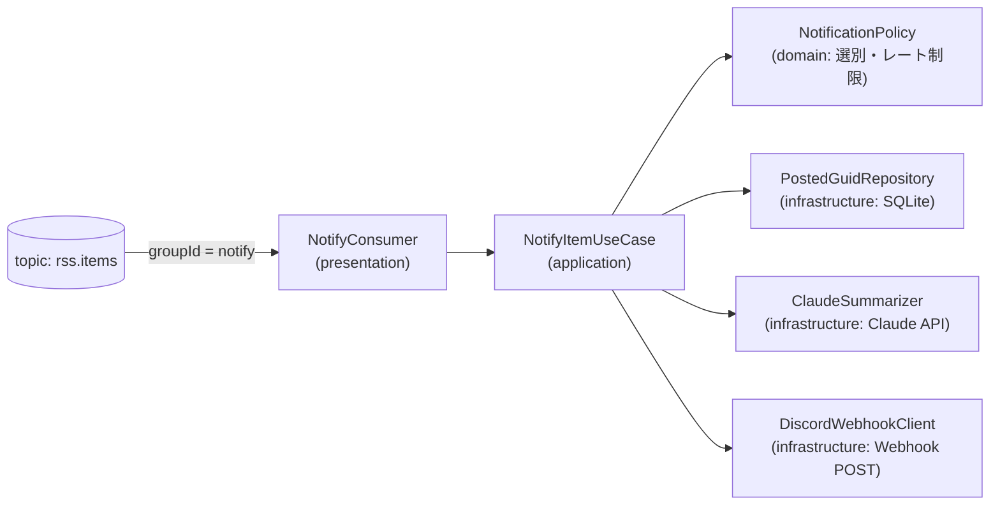

# Design Document

## Overview

`notify` feature を新設し、groupId = `notify` の consumer group で `rss.items` を購読する。受信メッセージを選別ルール(domain)にかけ、通過した記事を Claude API で 3 行要約し、Discord Webhook へ embed 投稿する。既存 feature(fetch / archive / live / report)には一切手を入れない。

## Steering Document Alignment

### Technical Standards (tech.md)

- 「新しい後段処理は topic `rss.items` を新しい consumer group で購読する feature として追加する」(structure.md 発展方針)にそのまま従う
- Kafka はパイプに徹し、投稿済み管理は DB(SQLite)に置く

### Project Structure (structure.md)

```
notify/
├── presentation/     # NotifyConsumer(@KafkaListener, groupId = "notify")
├── application/      # NotifyItemUseCase(選別 → 要約 → 投稿の編成)
├── domain/           # NotificationPolicy(選別・レート制限ルール。純 Kotlin)
└── infrastructure/   # ClaudeSummarizer・DiscordWebhookClient・PostedGuidRepository
```

feature 間依存はなし(自己完結)。`shared/contract/RssItem` のみ参照する。

## Code Reuse Analysis

- **RssItem(shared/contract)**: メッセージ契約をそのまま使う。フィールド追加なし
- **Flyway**: 投稿済み guid テーブルを `V{next}__notify_posted_guids.sql` で追加
- **kuery-client**: PostedGuidRepository の SQL に既存と同じスタイルを使う
- **EmbeddedKafka テスト基盤**: SinkConsumerIntegrationTest のパターンを流用

## Architecture



## Components and Interfaces

### NotifyConsumer(presentation)

- **Purpose:** `rss.items` を 1 件ずつ消費してユースケースへ渡す
- **Interfaces:** `@KafkaListener(topics = ["rss.items"], groupId = "notify")`
- **有効化条件:** `@ConditionalOnProperty`(Webhook URL 設定時のみ Bean 登録。要件 3.3)

### NotificationPolicy(domain)

- **Purpose:** 通知対象の選別(tech + キーワードあり)とレート制限判定。純 Kotlin
- **Interfaces:** `shouldNotify(item: RssItem, alreadyPosted: Boolean, recentPostCount: Int): Boolean`
- **設定:** 投稿間隔・時間あたり上限は application.yml から注入(ロジックは domain、値は外)

### NotifyItemUseCase(application)

- **Purpose:** 選別 → 投稿済み確認 → 要約 → 投稿 → 投稿済み記録の編成
- **エラー処理:** 要約失敗時は `Summary.None` でフォールバック投稿(要件 2.2)。Discord 失敗はリトライ後ログ(要件 3.2)

### ClaudeSummarizer(infrastructure)

- **Purpose:** タイトル + 概要から日本語 3 行要約を生成
- **Interfaces:** `summarize(title: String, summary: String): Result<String>`
- **実装:** Spring RestClient で Claude API(Messages API)を直接叩く(SDK 依存を増やさない)。モデル・プロンプト・max_tokens は設定値。API キーは環境変数 `ANTHROPIC_API_KEY`

### DiscordWebhookClient(infrastructure)

- **Purpose:** embed 形式(タイトル・URL・要約・キーワード)で Webhook に POST
- **実装:** RestClient。429(レート制限)は Retry-After を尊重して限定リトライ

### PostedGuidRepository(infrastructure)

- **Purpose:** 投稿済み guid の記録と照会(再配信・再起動での二重投稿防止)
- **Interfaces:** `isPosted(guid): Boolean`、`markPosted(guid)`、`countPostedSince(instant): Int`

## Data Models

Flyway マイグレーション(SQLite):

```sql
CREATE TABLE notify_posted (
  guid TEXT PRIMARY KEY,
  posted_at TEXT NOT NULL
);
```

## Error Handling

### Error Scenarios

1. **Claude API 失敗(タイムアウト・429・キー未設定)**
   - **Handling:** 要約なしフォールバック投稿。ログに理由を残す
   - **User Impact:** 要約の代わりにタイトル + リンクのみ届く
2. **Discord Webhook 失敗**
   - **Handling:** 限定リトライ → 失敗ならログしてスキップ(オフセットはコミットし、パイプラインを止めない)
   - **User Impact:** その記事の通知が欠けるだけ。DB には sink 経由で蓄積済み
3. **notifier 再起動**
   - **Handling:** consumer group `notify` のオフセットから再開。`notify_posted` により二重投稿なし
   - **User Impact:** なし

## Testing Strategy

### Unit Testing

- NotificationPolicy: tech/jobs・キーワード有無・投稿済み・レート制限超過の表駆動テスト
- NotifyItemUseCase: Summarizer / WebhookClient / Repository をモックし、フォールバック(要約失敗 → 要約なし投稿)とスキップ(投稿済み)を検証
- PostedGuidRepository: 一時ファイル SQLite で記録・照会・件数集計

### Integration Testing

- EmbeddedKafka で publish → notify 消費 → WebhookClient(モック)呼び出しを検証。同 guid 再配信で 2 回投稿されないこと

### End-to-End Testing

- 実 Webhook URL + 実 API キーを設定した手動確認(Discord に embed が届くこと)
