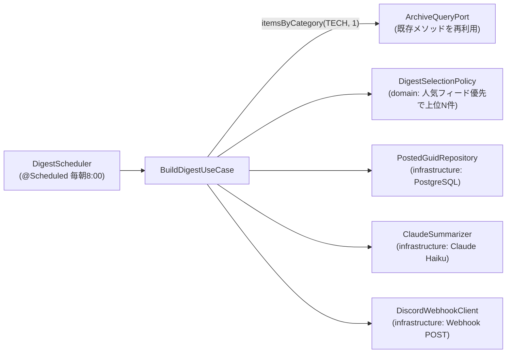

# Design Document

## Overview

`notify` feature を新設し、`@Scheduled` の定期ジョブ(既定: 毎朝 8:00)で **PostgreSQL の当日分 tech 記事を集計 → 上位 N 件を選抜 → Claude Haiku で 3 行要約 → Discord Webhook へ 1 通投稿** する。Kafka consumer は追加しない(fetcher と同じスケジュール駆動)。

既存 feature(fetch / archive / live / report)のコードは変更せず、archive の読み取りは `capabilities/ArchiveQueryPort` の**既存メソッド `itemsByCategory(ItemCategory.TECH, days)` をそのまま再利用**する(Port へのメソッド追加はしない。feature 間の直接 import もしない。structure.md 準拠)。

## Steering Document Alignment

### Technical Standards (tech.md)

- 「新しい後段処理を足す」を、Kafka の追加購読ではなく **スケジュール実行 + DB 集計**で実現。fetcher(`FetchScheduler` + `@Scheduled`)と同じ既存パターンの踏襲
- LLM/Discord 連携は Spring RestClient で直接呼ぶ(SDK 依存を増やさない)。デプロイ方針(fat jar + systemd)は不変

### Project Structure (structure.md)

```
notify/                # feature 一式を @ConditionalOnProperty(Webhook URL)で on/off(下記 Feature Toggle 参照)
├── presentation/     # DigestScheduler(@Scheduled)
├── application/      # BuildDigestUseCase(取得 → 選抜 → 要約 → 投稿 → 記録の編成)
├── domain/           # DigestSelectionPolicy(選抜ルール。純 Kotlin)
└── infrastructure/   # ClaudeSummarizer・DiscordWebhookClient・PostedGuidRepository
```

- notify → archive の読み取りは `capabilities/ArchiveQueryPort` 経由(実装は archive/application 側。直接 import しない)
- `shared/contract/RssItem` のみ共有参照

## Code Reuse Analysis

- **capabilities/ArchiveQueryPort**: 既存の `itemsByCategory(category, days)` を**そのまま再利用**する(メソッド追加なし)。このメソッドは既に「カテゴリ絞り込み・`COALESCE(published_at, fetched_at) >= now - days` の時間窓・新しい順・keywords 同梱(`item_keywords` を join)」を満たしており、`itemsByCategory(ItemCategory.TECH, 1)` が「直近24h の tech 記事(キーワード込み・新しい順)」に一致する。時間窓は日単位(既定 `days=1`)。サブ日単位の窓が将来必要になったら、平行メソッドを増やすのではなく `RssItemRepository.cutoff` を `Duration` 受けに一般化して既存 3 メソッドと共有する
- **@Scheduled 基盤**: `shared/config/SchedulingConfig` と fetch の `FetchScheduler` パターンを流用
- **kuery-client / Flyway**: 投稿済み guid テーブルを既存スタイルで追加
- **RssItem(shared/contract)**: メッセージ契約をそのまま使う

## Architecture



## Feature Toggle(有効化の設計)

notify feature は **Webhook URL の有無で機能一式を on/off** する。この二段構えで要件 3.3 / 4.3 を満たす:

1. **Webhook URL 未設定 → notify の Bean を一切登録しない。** notify の各 `@Component`(`DigestScheduler` / `BuildDigestUseCase` / `ClaudeSummarizer` / `DiscordWebhookClient` / `PostedGuidRepository`)にクラス共通のメタアノテーション、または notify を束ねる `@Configuration` に `@ConditionalOnProperty(name = "rss-watch.notify.discord-webhook-url")` を付ける。URL が無ければ Bean が生成されず、アプリは通常起動する(要件 4.3)。
2. **API キー未設定は「無効化」ではなく実行時フォールバック。** feature が有効(=Webhook URL あり)なら notify は起動し、`ANTHROPIC_API_KEY` が無い場合は `ClaudeSummarizer` が呼び出しに失敗して要約なし(タイトル + リンク + キーワード)で投稿を続ける(要件 2.2)。したがって API キーはトグル条件に含めない。
- 設定値を注入する `@Value` / `@ConfigurationProperties` には安全なデフォルト(空文字・既定モデル ID 等)を持たせ、feature 有効時に必須値(Webhook URL)が欠けてもコンテキスト起動が失敗しないようにする。

## Components and Interfaces

### DigestScheduler(presentation)

- **Purpose:** 定期実行のトリガ
- **Interfaces:** `@Scheduled(cron = "\${rss-watch.notify.cron}")` → `BuildDigestUseCase.run()`
- **有効化条件:** 上記 Feature Toggle により Webhook URL 設定時のみ Bean 登録(要件 3.3 / 4.3)

### DigestSelectionPolicy(domain)

- **Purpose:** 候補記事の選抜(純 Kotlin)。Phase 1 は「人気フィード優先」
- **Interfaces:** `select(candidates: List<RssItem>, limit: Int, alreadyPosted: Set<String>): List<RssItem>`
- **ルール:** ① 投稿済み guid を除外 → ② 人気フィード(設定 `rss-watch.notify.popular-feeds`。既定: はてなブックマーク テクノロジー / Qiita 人気記事 / Hacker News)由来を優先 → ③ 同順位は publishedAt 新しい順 → ④ 上位 `limit` 件。将来 interest-recommend のスコアリングに差し替え可能なように、選抜ロジックは domain に閉じる([[em-task-loop-workflow]] の interest-recommend と連携余地)

### BuildDigestUseCase(application)

- **Purpose:** 取得 → 選抜 → 要約 → 投稿 → 投稿済み記録 の編成
- **フロー:** `ArchiveQueryPort.itemsByCategory(ItemCategory.TECH, 1)` で直近 24h の tech 記事取得 → Policy で N 件選抜 → 各件を Summarizer で要約(失敗はフォールバック)→ DiscordWebhookClient で 1 通投稿 → 成功した guid を PostedGuidRepository に記録
- **エラー処理:** 候補 0 件はスキップ(要件 1.4)。要約失敗は要約なしで継続(要件 2.2)。Webhook 失敗はリトライ後ログ(要件 3.2)

### ClaudeSummarizer(infrastructure)

- **Purpose:** タイトル + 概要から日本語 3 行要約を生成
- **Interfaces:** `summarize(title: String, summary: String): Result<String>`
- **実装:** Spring RestClient で Claude **Messages API**(`POST https://api.anthropic.com/v1/messages`)を直接呼ぶ。
  - ヘッダ: `x-api-key: ${ANTHROPIC_API_KEY}`、`anthropic-version: 2023-06-01`、`content-type: application/json`
  - body: `{ "model": <設定値>, "max_tokens": <設定値>, "system": <3行要約の指示>, "messages": [{"role":"user","content": "<title>\n<summary>"}] }`
  - レスポンスの `content[0].text` を要約として取り出す
  - **既定モデル: Claude Haiku 4.5** — 再現性のため dated スナップショット `claude-haiku-4-5-20251001` を既定値に置く(undated エイリアス `claude-haiku-4-5` は将来のスナップショット追随で挙動が変わり得るため)。3 行要約に十分な品質で最安・高速。`max_tokens` は短め(既定 256 目安)。thinking/effort パラメータは付けない(Haiku 4.5 は effort 非対応)。モデル ID・system プロンプト・max_tokens は `application.yml` から注入

### DiscordWebhookClient(infrastructure)

- **Purpose:** N 件を embed 形式(タイトル・URL・要約・キーワード)で 1 通にまとめて Webhook に POST
- **実装:** RestClient。`embeds` 配列に最大 10 件。429(レート制限)は `Retry-After` を尊重して限定リトライ

### PostedGuidRepository(infrastructure)

- **Purpose:** 投稿済み guid の記録と照会(日跨ぎの二重投稿防止)
- **Interfaces:** `postedGuids(since: Instant): Set<String>`、`markPosted(guids: List<String>)`
- **冪等性:** `markPosted` は `INSERT ... ON CONFLICT (guid) DO NOTHING` で同 guid の再投入を無害化する
- **保守:** 候補は直近24h からしか来ないため古い行の掃除は当面しない。照会は `postedGuids(since)` で窓を絞る(`since` は取得窓と同程度)

## Data Models

Flyway マイグレーション(PostgreSQL)。既存 `V1__archive_initial.sql` と同じく `posted_at` は TIMESTAMPTZ とし、アプリは Instant を UTC の OffsetDateTime に変換してバインドする(`RssItemRepository` と同じ作法):

```sql
CREATE TABLE notify_posted (
  guid TEXT PRIMARY KEY,
  posted_at TIMESTAMPTZ NOT NULL
);
```

## Error Handling

### Error Scenarios

1. **Claude API 失敗(タイムアウト・429・キー未設定)**
   - **Handling:** その記事は要約なし(タイトル + リンク + キーワード)でダイジェストに載せる。ログに理由を残す
   - **User Impact:** 一部の要約が欠けるだけ
2. **Discord Webhook 失敗**
   - **Handling:** 限定リトライ → 失敗ならログ。投稿済み記録は行わない(翌日ジョブで再度候補になり得る)
   - **User Impact:** その日のダイジェストが届かないが、記事自体は DB に蓄積済み
3. **候補 0 件 / DB 一時停止**
   - **Handling:** スキップしてログ。次回スケジュールで通常実行
   - **User Impact:** その回は投稿なし。パイプライン本体は無影響

## Testing Strategy

### Unit Testing

- DigestSelectionPolicy: 投稿済み除外・人気フィード優先・publishedAt タイブレーク・上限 N・候補 0 件 の表駆動テスト
- BuildDigestUseCase: ArchiveQueryPort / Policy / Summarizer / WebhookClient / Repository をモックし、①正常(要約付き投稿 + markPosted)②要約失敗 → フォールバック投稿 ③候補 0 → 投稿しない ④Webhook 失敗 → markPosted しない を検証
- ClaudeSummarizer: MockRestServiceServer で正常レスポンス → 3 行要約、タイムアウト・429・不正レスポンス → Result.failure
- DiscordWebhookClient: embed ペイロード構造、429 の Retry-After リトライ、リトライ上限で failure
- PostedGuidRepository: 共有 Testcontainers PostgreSQL(`SharedPostgresContainer`)で記録・照会

### Integration Testing

- 再利用する `itemsByCategory(TECH, days)` は archive 側の既存テスト(`ArchiveQueryPortImplTest`)で時間窓・カテゴリ絞り込み・keywords 同梱が既に担保済み。notify 側で Port クエリの新規結合テストは追加しない(メソッドを増やさないため)

### End-to-End Testing

- 実 Webhook URL + 実 API キーを設定し、スケジュールを直近に寄せて手動確認(Discord に N 件の embed が 1 通届くこと)
