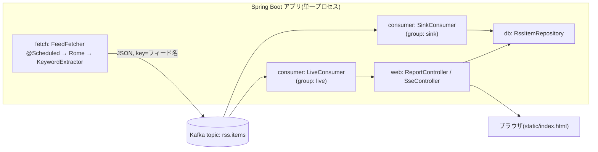

# Design Document

## Overview

MVP パイプライン全体の設計。Spring Boot 単一アプリ内に fetcher(producer)・sink consumer・live consumer・Web(集計 API + SSE)を同居させ、Kafka(`rss.items` 1 topic)を介して疎結合にする。

## Steering Document Alignment

### Technical Standards (tech.md)

tech.md の「1 topic + 2 consumer group」「蓄積は DB、Kafka はパイプ」「定期実行は @Scheduled」の決定にそのまま従う。

### Project Structure (structure.md)

structure.md のパッケージ構成(config / model / fetch / keywords / consumer / db / web)に従い、レイヤー間の依存方向(web → db、live consumer は DB を経由しない)を守る。

## Code Reuse Analysis

新規リポジトリのため既存コードはない。既存資産として以下を引き継ぐ:

- **feeds.toml**: Python 試作から引き継いだフィード定義(tech 5 本・jobs 4 本)。フォーマットはそのまま使う
- **キーワード辞書の設計知見**: 独自境界の正規表現・`Go` の別枠扱い(tech.md 決定ログ 5)

## Architecture



### Modular Design Principles

- fetch / keywords / consumer / db / web は互いに model と設定クラスのみを共有する
- Kafka のシリアライズ形式(JSON)は model の 1 箇所で定義する

## Components and Interfaces

### FeedFetcher(fetch)

- **Purpose:** `@Scheduled` で `feeds.toml` の全フィードを巡回し、Rome でパース → キーワード抽出 → `rss.items` へ publish
- **Interfaces:** `fetchAll()`(スケジューラから起動)
- **Dependencies:** FeedConfig(config)、KeywordExtractor(keywords)、KafkaTemplate
- **エラー処理:** フィード単位で try-catch。失敗はログして続行(要件 1.3)

### KeywordExtractor(keywords)

- **Purpose:** タイトル + 概要から技術キーワード(正規化名)の集合を返す
- **Interfaces:** `extract(text: String): Set<String>`
- **実装:** 辞書(正規化名 → エイリアス列)から起動時に正規表現をコンパイル。独自境界 `(?<![A-Za-z0-9])...(?![A-Za-z0-9+#])`。大文字小文字を区別する別枠(`Go` 等)を持つ

### SinkConsumer(consumer)

- **Purpose:** `rss.items` をマイクロバッチで消費し、リポジトリ経由で冪等書き込み
- **Interfaces:** spring-kafka のバッチリスナー(`@KafkaListener(groupId = "sink", batch = true)`)
- **Dependencies:** RssItemRepository
- **コミット戦略:** バッチ書き込み成功後にオフセットコミット

### LiveConsumer(consumer)

- **Purpose:** `rss.items` を 1 件ずつ即時消費し、SSE ブロードキャスターへ渡す
- **Interfaces:** `@KafkaListener(groupId = "live")`
- **Dependencies:** SseBroadcaster(web)。DB には触らない

### RssItemRepository(db)

- **Purpose:** SQLite への冪等書き込みと集計クエリ
- **Interfaces:** `insertIgnore(items: List<RssItem>): Int`、`techRanking(days: Int)`、`itemsByCategory(category, days)`、`itemsByKeyword(keyword, days)`
- **実装:** JdbcTemplate + 生 SQL。`guid UNIQUE`。SQLite 依存をこのクラスに閉じ込める

### ReportController / SseController(web)

- **Purpose:** 集計 API(`GET /api/report?days=N`)と SSE(`GET /api/stream`)、静的 UI の配信
- **Dependencies:** RssItemRepository(report)、SseBroadcaster(stream)
- **SseBroadcaster:** 接続中の `SseEmitter` を管理し、切断時はリストから除去(要件 4.3)

## Data Models

### RssItem(model / Kafka メッセージ / DB 行)

```
- guid: String          # RSS エントリの一意キー(DB では UNIQUE)
- feedName: String      # フィード名(Kafka の key にも使う)
- category: String      # "tech" | "jobs"
- title: String
- url: String
- summary: String       # 概要(キーワード抽出対象)
- publishedAt: Instant?
- fetchedAt: Instant
- keywords: List<String> # 抽出済みの正規化キーワード
```

DB スキーマ(SQLite):

```sql
CREATE TABLE IF NOT EXISTS items (
  guid TEXT PRIMARY KEY,
  feed_name TEXT NOT NULL,
  category TEXT NOT NULL,
  title TEXT NOT NULL,
  url TEXT NOT NULL,
  summary TEXT,
  published_at TEXT,
  fetched_at TEXT NOT NULL
);
CREATE TABLE IF NOT EXISTS item_keywords (
  guid TEXT NOT NULL,
  keyword TEXT NOT NULL,
  PRIMARY KEY (guid, keyword)
);
```

## Error Handling

### Error Scenarios

1. **フィード取得失敗(タイムアウト・パースエラー)**
   - **Handling:** フィード単位でスキップしてログ。次回巡回で再試行
   - **User Impact:** 該当フィードの新着が 1 周期遅れるだけ
2. **Kafka ブローカー停止中の publish**
   - **Handling:** producer の再試行に任せ、失敗はログ。fetcher は次周期で再巡回するため取りこぼしても次回拾える
   - **User Impact:** 新着反映が遅れる
3. **sink の DB 書き込み失敗**
   - **Handling:** オフセットをコミットしない → 再配信される。冪等書き込みなので重複しない
   - **User Impact:** なし(遅延のみ)
4. **SSE クライアント切断**
   - **Handling:** emitter の onCompletion / onTimeout で除去
   - **User Impact:** なし

## Testing Strategy

### Unit Testing

- KeywordExtractor: 日本語文中の検出・`Go` の別枠・エイリアス正規化(最重要。表駆動テスト)
- RssItemRepository: 冪等 insert(同 guid 2 回で 1 行)、集計クエリ

### Integration Testing

- EmbeddedKafka で publish → sink → DB の一連を検証(再配信しても行数が増えないこと)
- sink 停止 → publish 継続 → sink 再起動で catch-up することの検証

### End-to-End Testing

- Docker Compose の Kafka に対しアプリを起動し、`/api/report` と `/api/stream` を手動確認(MVP では手動で可)
