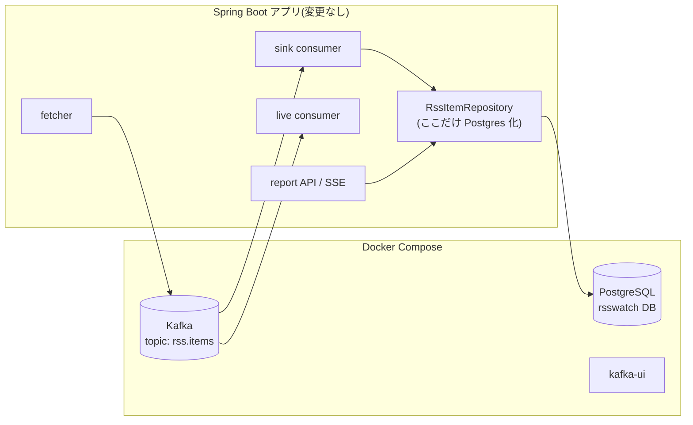

# Design Document

## Overview

SQLite を PostgreSQL(compose 管理・単一ノード)に置き換える。アプリのアーキテクチャ(fetcher → Kafka → sink/live → API/UI)と API 契約は一切変えず、archive/infrastructure と実行環境(compose・設定・テスト基盤)だけを差し替える。

## Steering Document Alignment

### Technical Standards (tech.md)

- tech.md 決定ログ「リポジトリ層を分離し、将来 PostgreSQL へ差し替え可能にする」(Data Storage)の実行
- 「蓄積は DB、Kafka はパイプ」「スキーマ管理は Flyway」「DB アクセスは kuery-client で生 SQL」の方針は維持
- Known Limitations の「SQLite は Flyway ではコミュニティサポート」が解消される(PostgreSQL は両ツールとも公式サポート)
- 移行完了時に tech.md の SQLite 記述・アーキテクチャ図を PostgreSQL に更新する(Task に含める)

### Project Structure (structure.md)

パッケージ構成・依存方向は変更しない。DB 方言依存は引き続き archive/infrastructure の `RssItemRepository` に閉じる。

## Code Reuse Analysis

- **RssItemRepository の SQL 資産**: JOIN・GROUP BY・COALESCE を使う集計クエリは ANSI 準拠なのでほぼそのまま流用。変更は「`INSERT OR IGNORE` → `INSERT ... ON CONFLICT DO NOTHING`」と「タイムスタンプの型」の 2 点に集約される
- **kuery-client / Flyway / Spring Boot 統合**: そのまま利用(DataSource の接続先が変わるだけ)
- **docker/docker-compose.yml**: kafka で確立したパターン(named volume・healthcheck・ループバック限定 bind・`restart: unless-stopped`)を postgres サービスに横展開
- **既存テストスイート**: テストコードの検証内容(冪等性・集計・catch-up)は原則変更せず、実行基盤だけ Testcontainers に載せ替える。唯一の例外はタイムスタンプ精度に依存する境界値テスト(下記「タイムスタンプ精度」参照)

## Architecture



### Modular Design Principles

- 方言差(UPSERT 構文・型マッピング)は `RssItemRepository` の内側で完結させ、`ItemStore` / `ItemQueries` インターフェイスは変更しない
- ArchitectureTest の「domain が DB 実装に依存しない」ルールはそのまま効かせる

## Components and Interfaces

### docker-compose.yml(postgres サービス追加)

- **イメージ**: `postgres:17-alpine`(メジャーバージョンを固定)
- **設定**: `POSTGRES_DB: rsswatch` / `POSTGRES_USER: rsswatch` / `POSTGRES_PASSWORD`(compose 内デフォルト値。ループバック限定なので秘匿性は要求しない)
- **永続化**: named volume `postgres-data` → `/var/lib/postgresql/data`
- **ポート**: `127.0.0.1:5432:5432`(LAN 非露出。kafka と同方針)
- **healthcheck**: `pg_isready -U rsswatch`
- **restart**: `unless-stopped`(自宅サーバーの再起動後に自動復帰)

### build.gradle.kts

- 追加: `org.postgresql:postgresql`、`org.flywaydb:flyway-database-postgresql`(Flyway 10 以降は DB モジュールが分離されている)、`org.springframework.boot:spring-boot-testcontainers`、`org.testcontainers:postgresql`、`org.testcontainers:junit-jupiter`
- 削除: `org.xerial:sqlite-jdbc`(削除はテストの Testcontainers 移行後。`RssItemRepositoryTest` が `SQLiteDataSource` を import しているため、先に削除するとテスト全体がコンパイルエラーになる)

### application.yml / 環境変数

```yaml
datasource:
  url: ${RSS_WATCH_DB_URL:jdbc:postgresql://localhost:5432/rsswatch}
  username: ${RSS_WATCH_DB_USER:rsswatch}
  password: ${RSS_WATCH_DB_PASSWORD:rsswatch}
```

- `RSS_WATCH_DB_PATH` は廃止し、README の環境変数表を差し替える
- HikariCP の `maximum-pool-size: 1`(SQLite の直列化対策)を削除しデフォルトに戻す

### RssItemRepository(archive/infrastructure)

- **Interfaces:** `ItemStore` / `ItemQueries` は不変
- **insertIgnore**: `INSERT OR IGNORE` → `INSERT ... ON CONFLICT (guid) DO NOTHING`(item_keywords は `ON CONFLICT (guid, keyword) DO NOTHING`)
- **タイムスタンプ**: 固定桁 TEXT フォーマッタ(`TIMESTAMP_FORMAT`)と `Instant.parse` を廃止。`Instant` は UTC の `OffsetDateTime` に変換してバインドし、読み出しも `OffsetDateTime` → `Instant` に変換する(JDBC 4.2 の標準マッピング。詳細は実装タスクで検証)
- **期間フィルタ**: `COALESCE(published_at, fetched_at) >= ?` の比較を TIMESTAMPTZ 同士の比較に変更(SQL の形はそのまま)
- **タイムスタンプ精度**: `TIMESTAMPTZ` はマイクロ秒精度で、ナノ秒は保存時に失われる。既存テストの「cutoff より 1 ナノ秒古い item は除外される」という境界値ケースはマイクロ秒基準に書き換える。これは実装の都合ではなく格納精度という仕様の変更に伴う正当なテスト更新であり、CLAUDE.md の「テスト自体を変更してはいけない」(Red→Green 中の禁止事項)には抵触しない
- クラスの KDoc から SQLite 前提の説明(辞書順トリック)を削除し、PostgreSQL 前提に書き換える

### SqliteDialectProvider(削除)

spring-data-jdbc は PostgreSQL の Dialect を同梱するため、SPI 補完クラスを削除し、`META-INF/spring.factories`(この登録 1 行だけのファイル)もファイルごと削除する。あわせて ArchitectureTest の domain 禁止 import リストの `org.sqlite.` を `org.postgresql.` に差し替える。

### Flyway マイグレーション

`V1__archive_initial.sql` を PostgreSQL 用に書き直す(履歴を引き継ぐ既存環境がないため V2 ではなく V1 を書き換える。要件 3.4):

```sql
CREATE TABLE items (
    guid TEXT PRIMARY KEY,
    feed_name TEXT NOT NULL,
    category TEXT NOT NULL,
    title TEXT NOT NULL,
    url TEXT NOT NULL,
    summary TEXT,
    published_at TIMESTAMPTZ,
    fetched_at TIMESTAMPTZ NOT NULL
);

CREATE TABLE item_keywords (
    guid TEXT NOT NULL,
    keyword TEXT NOT NULL,
    PRIMARY KEY (guid, keyword)
);

CREATE INDEX idx_items_category ON items (category);
CREATE INDEX idx_item_keywords_keyword ON item_keywords (keyword);
```

### テスト基盤(Testcontainers)

DB を使うテストは実行形態が 2 種類あり、接続方法を分ける:

- **Spring コンテキストを立てるテスト**(`RssWatchApplicationTest`・`SinkConsumerIntegrationTest`・`LiveConsumerIntegrationTest`。現在 `jdbc:sqlite:` URL をハードコード): 共有コンテナ(static singleton)+ `@ServiceConnection` で接続する
- **`RssItemRepositoryTest`**(Spring コンテキストなしの素の JUnit。現在 `SQLiteDataSource` を手組み): `@ServiceConnection` は使えないため、共有コンテナの `jdbcUrl` から DataSource を手組みする
- **MockMvc テスト**(`ReportControllerTest`・`SseControllerTest`)は `standaloneSetup` で DB を使わないため対象外
- domain の単体テスト(KeywordExtractor 等)はコンテナ不要のまま(要件 4.3)

## Data Models

`RssItem`(Kotlin データクラス・Kafka メッセージ JSON)は変更なし。DB スキーマの変更点はタイムスタンプ 2 列の `TEXT` → `TIMESTAMPTZ` のみ(上記 DDL)。

`item_keywords.guid` → `items.guid` の外部キーは SQLite 時代から存在せず、今回も追加しない(機能同等を優先するスコープ判断。RDBMS らしい整合性強化は将来の改善余地として残す)。

## 既存データの扱い(移行しない)

SQLite → PostgreSQL のデータコピーは行わない。根拠:

- 運用開始直後でデータ資産が小さく、Kafka の topic `rss.items` に retention(デフォルト 7 日)内の全メッセージが残っている
- sink consumer group のオフセットを earliest にリセットすれば、新しい空の PostgreSQL に catch-up で再蓄積される(この構成の学習ポイントの実演でもある)

```bash
# アプリ停止中に実行
docker exec rss-watch-kafka /opt/kafka/bin/kafka-consumer-groups.sh \
  --bootstrap-server localhost:29092 \
  --group sink --topic rss.items --reset-offsets --to-earliest --execute
```

- retention を超えた古いメッセージは失われるが、個人ツールとして許容する(README に明記)
- live consumer group はリセットしない(過去分を SSE に流し直す意味がないため)

## Error Handling

### Error Scenarios

1. **アプリ起動時に PostgreSQL 未起動**
   - **Handling:** DataSource 初期化 / Flyway で起動失敗 → systemd の `Restart=always` が再試行(compose 側は `restart: unless-stopped` で先に上がる)
   - **User Impact:** 起動が数十秒遅れるだけ
2. **稼働中に PostgreSQL が停止**
   - **Handling:** sink は書き込み失敗でオフセットをコミットしない → 復旧後に再配信され、冪等書き込みで重複なく回復(要件 1.4)。report API は 500 を返す
   - **User Impact:** 停止中はレポートが見られない。live(SSE)は DB を経由しないため影響なし
3. **接続プール枯渇・長時間クエリ**
   - **Handling:** HikariCP デフォルト(接続タイムアウト 30 秒)に任せる。この規模で問題化したら設定を見直す

## Testing Strategy

### Unit Testing

- domain 層のテストは変更なし(コンテナ不要・高速のまま)
- RssItemRepositoryTest: 検証内容(冪等 insert・集計・期間境界)は維持し、接続先を Testcontainers の PostgreSQL に変更。タイムスタンプが型として往復すること(保存 → 読み出しで `Instant` がマイクロ秒精度で一致)を確認するケースを追加し、ナノ秒境界のケースはマイクロ秒境界に書き換える

### Integration Testing

- EmbeddedKafka 結合テスト(sink → DB、catch-up)は Kafka 部分を変えず、DB 部分だけ Testcontainers に載せ替える
- 既存の全テストがパスすること自体が移行の受け入れ条件(要件 1.3)
- CI(GitHub Actions / ubuntu-latest)は Docker が利用可能なため Testcontainers はそのまま動く。初回のイメージ pull の分だけ CI 時間が延びる点は許容する

### End-to-End Testing

- README の「動作確認(ローカル)」手順を PostgreSQL 前提(`psql` での確認コマンド)に更新し、一通り手動実行して確認する
