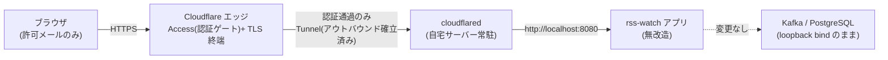

# Design Document

## Overview

自宅サーバーで `cloudflared`(Cloudflare Tunnel コネクタ)を常駐させ、Cloudflare が管理するドメインのホスト名(例 `rss.example.com`)をアプリの `http://localhost:8080` に結ぶ。そのホスト名に **Cloudflare Access のアプリケーション + ポリシー**を適用し、許可したメールアドレスだけがエッジで認証を通過してオリジンへ到達できるようにする。

**アプリ本体は無改造**。認証・TLS 終端・アクセス制御はすべて Cloudflare 側で完結し、`notify` / `archive` / `live` / `report` / `fetch` の各 feature には一切触れない。この spec の成果物は「Cloudflare 側の設定」と「`cloudflared` の常駐」「README の手順」であり、プロダクションコードは追加しない(任意の追加ハードニングを実装する場合のみ例外。後述)。

## Steering Document Alignment

### Technical Standards (tech.md)

- デプロイ方針(fat jar + systemd、Kafka/PostgreSQL は docker compose)を変更しない。`cloudflared` を「もう 1 つの常駐プロセス」として足すだけ
- 認証をミドルウェア(Cloudflare エッジ)に寄せ、アプリは単一責務(RSS パイプライン + 表示)を保つ

### Project Structure (structure.md)

- `src/main/kotlin` 配下は変更しない(feature パッケージに手を入れない)
- 追加物はインフラ/運用側: `cloudflared` の設定と README の手順。任意ハードニングを行う場合のみ `shared/config/` にフィルタを 1 つ足す

## Code Reuse Analysis

- **アプリコード**: 再利用も改修もなし(振る舞いを変えない)
- **docker compose(docker/docker-compose.yml)**: 既存の Kafka/PostgreSQL と同じ compose に `cloudflared` サービスを足す構成を選べる(systemd で常駐させる構成も可)
- **README の起動手順**: 既存「自宅サーバー(常駐運用)」節に公開手順を追記する

## Architecture

- ルーターのポート開放は不要。`cloudflared` が Cloudflare へ**アウトバウンド**でトンネルを張るため、インバウンドの穴を開けない
- オリジン(`:8080`)は従来どおり LAN 内のみ到達可能。インターネットからの唯一の経路はトンネル + Access

## Components and Interfaces

### Cloudflare Tunnel(named tunnel)

- **Purpose:** 公開ホスト名 → `http://localhost:8080` のルーティング
- **構成:** ダッシュボード(Zero Trust → Networks → Tunnels)で named tunnel を作成し、Public Hostname に `rss.example.com` → Service `http://localhost:8080` を登録
- **資格情報:** トンネルトークン(または credentials.json)。**シークレット**としてサーバー上で管理(コミットしない)

### cloudflared(常駐ランタイム)

- **Purpose:** 自宅サーバーでトンネルを張り続けるコネクタ
- **構成の選択肢(いずれか):**
  - **docker compose に追加**: `cloudflare/cloudflared:latest` を `command: tunnel run --token <TOKEN>` で起動。既存 compose と一緒に `restart: unless-stopped` で常駐(トークンは `.env` / 環境変数で注入)
  - **systemd**: `cloudflared service install <TOKEN>` で systemd unit を作成し `enable --now`
- **設計判断:** RSS アプリと同じ compose に載せると起動・再起動運用を 1 箇所に集約できる。トークンをコミットしないよう compose には直書きせず環境変数参照にする

### Cloudflare Access(認証ポリシー)

- **Purpose:** 公開ホスト名に到達する前段でのアイデンティティ検証
- **構成:** Zero Trust → Access → Applications で Self-hosted アプリを作成し、ドメインに `rss.example.com` を指定。Policy に「Emails: 許可する数人のアドレス」を Allow で設定
- **認証方式:** 既定は One-time PIN(メール OTP)。必要なら Google / GitHub IdP を追加
- **セッション:** Session Duration で有効期間を設定(既定 24h 等)。通過後は `CF_Authorization` Cookie で維持

### SSE(`/api/stream`)の通過

- `EventSource` は Cookie を自動送出するため、初回にブラウザで Access 認証を済ませておけば SSE 接続も追加操作なしで通る(要件 3.2)
- 長寿命ストリームがトンネル経由で維持されることを E2E で確認する。無通信で切れる場合は、将来 SSE にハートビート(`:keep-alive` コメントの定期送出)を足す(この spec のスコープ外。必要が判明したら別タスク化)

### 任意の追加ハードニング(Phase 2 / スコープ外)

- 自宅 LAN からの `:8080` 直アクセスも塞ぎたい場合、オリジン側で `Cf-Access-Jwt-Assertion` ヘッダの JWT を検証するフィルタを `shared/config/` に足し、Cloudflare の公開鍵(JWKS)で検証する(= Access を経由しないリクエストを拒否)
- 個人ツール・自宅 LAN の信頼レベルでは必須ではないため、既定ではアプリ無改造を維持する。実装する場合のみ、この項をテスト付きの追加タスクに昇格する

## Data Models

なし(アプリ・DB の変更なし)

## Error Handling

### Error Scenarios

1. **許可外アドレスでのアクセス**
   - **Handling:** Cloudflare Access が Deny。オリジンには届かない
   - **User Impact:** アクセス拒否画面が表示される
2. **cloudflared が停止/未起動**
   - **Handling:** 公開ホスト名が 5xx / 到達不可になる(フェイルセーフ: 未起動なら「何も公開されない」安全側に倒れる)。アプリ本体は自宅内で継続稼働
   - **User Impact:** 外部からは見えないが、LAN 内・パイプラインは無影響
3. **トンネルトークンの漏洩**
   - **Handling:** ダッシュボードでトンネルを無効化/再発行。トークンはシークレット管理を徹底
   - **User Impact:** 再設定までの間、公開停止

## Testing Strategy

この spec はアプリの振る舞いを変えないため、**自動テストの追加は行わない**(既存スイートも変更不要)。検証は手動 E2E で行う。

### End-to-End Testing(手動)

- **許可アカウント**: 公開 URL → Access 認証 → クロスリンク UI 表示 → SSE 新着受信 まで通ることを確認
- **許可外アカウント**: Access で拒否され、オリジンに到達しない(UI・API とも見えない)ことを確認
- **ポリシー即時反映**: 許可メールを 1 件追加/削除し、アプリ再起動なしで反映されることを確認
- **フェイルセーフ**: `cloudflared` を停止すると公開だけ止まり、LAN 内アクセス・パイプライン(fetch → Kafka → sink/live/notify)が継続することを確認

### 任意ハードニングを実装する場合のみ

- `Cf-Access-Jwt-Assertion` 検証フィルタを足すなら、有効 JWT で通過・無し/不正 JWT で 401、を MockMvc + JWKS スタブでテストしてから実装する(TDD)
