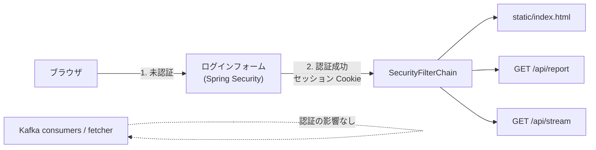

# Design Document

## Overview

spring-boot-starter-security を追加し、`shared/config/SecurityConfig` の 1 クラスで全 HTTP エンドポイント(静的 UI・レポート API・SSE)を認証必須にする。ユーザーは外部化設定(環境変数)で定義し、フォームログイン + セッション Cookie で運用する。feature パッケージには一切手を入れない。

## Steering Document Alignment

### Technical Standards (tech.md)

- Spring Boot の標準機構(Spring Security)をそのまま使う。「定番の形」を重視する方針に合致
- HTTPS 終端はアプリ外(リバースプロキシ)。デプロイ方針(fat jar + systemd)は変えない

### Project Structure (structure.md)

- Security 設定・ユーザー定義プロパティは `shared/config/` に置く(機能横断の Spring 設定の置き場所)
- 各 feature の presentation は変更しない。認証はサーブレットフィルタで横断適用される

## Code Reuse Analysis

- **shared/config**: 既存の Kafka 設定等と同じ場所に SecurityConfig を追加
- **既存テスト**: MockMvc テスト(ReportControllerTest 等)は `spring-security-test` の `@WithMockUser` / `SecurityMockMvcRequestPostProcessors` で最小修正にとどめる

## Architecture

## Components and Interfaces

### SecurityConfig(shared/config)

- **Purpose:** SecurityFilterChain の定義。全パス認証必須、フォームログイン有効
- **Interfaces:** `@Bean fun securityFilterChain(http: HttpSecurity): SecurityFilterChain`
- **設計判断:**
  - フォームログイン(セッション Cookie)を採用。SSE の `EventSource` はカスタムヘッダーを付けられないため、Cookie ベースが最も自然(要件 3.2)
  - CSRF は Spring Security デフォルトのまま有効。現状の API は GET のみなので影響なし。将来 POST API を足すときに再検討する
  - ログアウトは `/logout`(デフォルト)を使う

### RssWatchUsersProperties(shared/config)

- **Purpose:** ユーザー定義の外部化設定(`@ConfigurationProperties(prefix = "rsswatch.auth")`)
- **形式:** `rsswatch.auth.users[0].name` / `.password`(bcrypt ハッシュ)。環境変数からの上書きに対応
- **Interfaces:** `InMemoryUserDetailsManager` の Bean に変換して Spring Security へ渡す

### ログインページ

- Spring Security のデフォルトログインページで開始する。カスタマイズは任意タスク(スコープ外でも可)

## Data Models

なし(ユーザーは設定のみ。DB 変更なし)

## Error Handling

### Error Scenarios

1. **未認証アクセス**
   - **Handling:** ブラウザ向けはログインページへリダイレクト。`Accept: text/event-stream` / API クライアントには 401
   - **User Impact:** ログインを求められるだけ
2. **認証失敗(パスワード誤り)**
   - **Handling:** Spring Security デフォルト(エラー表示付きでログインページへ戻す)
   - **User Impact:** 再入力
3. **ユーザー設定が空のまま起動**
   - **Handling:** 起動時に fail-fast(明確なエラーメッセージ)。認証なしで公開される事故を防ぐ
   - **User Impact:** 設定してから再起動する

## Testing Strategy

### Unit Testing

- RssWatchUsersProperties: 設定バインド(複数ユーザー・空設定で fail-fast)のテスト

### Integration Testing

- MockMvc + spring-security-test:
  - 未認証で `/api/report` → 401/302、`/` → ログインページ誘導
  - 認証済み(`@WithMockUser`)で既存レスポンスがそのまま返ること
  - `/logout` 後に再び未認証扱いになること
- 既存の EmbeddedKafka 統合テスト(sink / live / notify)が認証追加後もグリーンであること

### End-to-End Testing

- ブラウザで ログイン → クロスリンク表示 → SSE 新着受信 → ログアウト を手動確認
