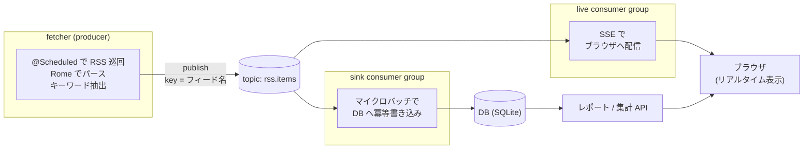

# Technology Stack

## Project Type

自宅サーバーで常駐運用する Web アプリケーション。RSS 取得と表示の間に Kafka を挟んだイベント駆動構成。

## Core Technologies

### Primary Language(s)

- **Language**: Kotlin(JVM 21)
- **Language-specific tools**: Gradle(Kotlin DSL)

### Key Dependencies/Libraries

- **Spring Boot**: アプリケーション基盤(spring-boot-starter-web, spring-kafka)
- **Rome**: RSS/Atom パース。フィード形式の差異を吸収する JVM の定番パーサー
- **Apache Kafka**: メッセージング(KRaft モード、シングルブローカー)
- **kafka-ui**: ブラウザで topic の中身を確認する運用ツール
- **SQLite**(JDBC): 蓄積・集計。将来 PostgreSQL に差し替え可能な構造にする

### Application Architecture

取得と表示の間に Kafka を挟んだイベント駆動構成。

| コンポーネント | 役割 | 消費戦略 |
|---|---|---|
| fetcher | RSS 取得 → キーワード付与 → `rss.items` へ publish | -(producer) |
| sink consumer | DB への蓄積。集計・レポートの元データを作る | マイクロバッチ。遅延より「確実に全件」優先 |
| live consumer | SSE でブラウザへ新着をリアルタイム配信 | 1 件ずつ即時。低遅延優先 |

同じ topic を **2 つの consumer group が独立したオフセットで読む**のがこの構成の核。sink を止めても live は流れ続け、sink を再起動すると溜まった分を catch-up する。

### Data Storage

- **Primary storage**: SQLite(`guid UNIQUE` + `INSERT OR IGNORE` 相当の冪等書き込み)。リポジトリ層を分離し、将来 PostgreSQL へ差し替え可能にする
- **Data formats**: Kafka メッセージは JSON(キーワード抽出済みのエントリ)

### External Integrations

- **APIs**: 各 RSS/Atom フィード(HTTP GET)
- **Protocols**: HTTP/REST(集計 API)、SSE(リアルタイム配信)

## Development Environment

### Build & Development Tools

- **Build System**: Gradle(Kotlin DSL)、fat jar(bootJar)
- **ローカル実行**: Docker Compose(Kafka + kafka-ui)+ `./gradlew bootRun`

### Code Quality Tools

- **Testing Framework**: JUnit 5 + spring-kafka-test(EmbeddedKafka)

### Version Control & Collaboration

- **VCS**: Git / GitHub(`tech-and-job-rss-reader`)
- **Branching Strategy**: main 直 push は避け、feature ブランチ + PR

## Deployment & Distribution

- **Target Platform**: 自宅サーバー + Docker Compose(Kafka)、アプリは fat jar + systemd または Docker
- **Update Mechanism**: 手動デプロイ。プロセス停止時の巡回停止は systemd の自動再起動で対処

## Technical Decisions & Rationale

個々の決定の背景・トレードオフの詳細は study-notes の[アーキテクチャ決定ログ](https://github.com/rockyh0825/study-notes)(`docs/rss-watch/architecture-decisions.md`)を参照。要点:

1. **Kotlin(JVM)で実装**: 就活での実績作り + Kafka が JVM ネイティブ(公式クライアント・Kafka Streams は JVM)。1 言語で fetcher〜Web まで揃う保守性を優先
2. **Kafka 採用**: 規模的にはオーバーキルと理解した上で、学習題材として採用。実データが継続的に流れ、at-least-once + 冪等 sink の定番パターンをそのまま体験できる
3. **Spring Boot 採用(vs Ktor)**: 日本のサーバーサイド求人での需要と spring-kafka の「定番の形」を重視。cleaning-app と知識を相互流用
4. **1 topic + 2 consumer group**: `rss.items` 1 本を sink(マイクロバッチ・確実性優先)と live(即時・低遅延優先)が独立オフセットで読む。key はフィード名にしてパーティショニングを観察
5. **キーワード抽出は辞書ベース**: 透明性と保守の容易さを優先。日本語文中では `\b` が機能しないため、独自境界 `(?<![A-Za-z0-9])...(?![A-Za-z0-9+#])` を使う。`Go` は大文字小文字を区別する別枠で扱う
6. **蓄積は DB、Kafka はパイプ**: 集計は DB(SQLite)、Kafka は輸送路に徹する。ブラウザへの配信は SSE で中継(単方向で十分なので WebSocket は使わない)
7. **定期実行は @Scheduled**: 外部スケジューラに依存せず、デプロイ物を 1 つにまとめる

## Known Limitations

- キーワード辞書は手動メンテが必要(辞書にない新技術は拾えない)
- enricher を分離しないため「topic → 変換 → 別 topic」(Kafka Streams の典型)は最初のスコープ外。学習が進んだら切り出す拡張余地を残す
- 日本語の求人 RSS がほぼ存在せず、求人データは英語圏中心
